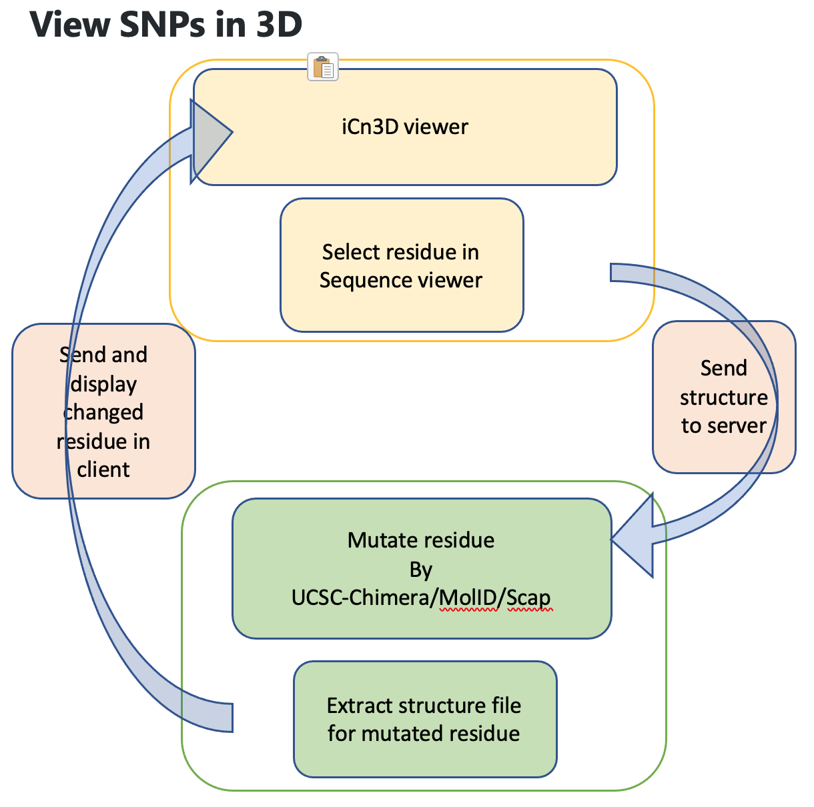

# View SNPs in 3D, or Find Symmetries of 3D Structures

# Project 1: View SNPs in 3D
iCn3D shows SNPs in the sequences. It will be interesting to show the mutated residues in 3D directly. We could use the leap program in AMBER, SCWRL, or other programs.

Here is one example on displaying SNPs in sequences of PDB ID 1TUP: https://structure.ncbi.nlm.nih.gov/icn3d/share.html?qCkdyrBHfkdKhLcx5. 



## Preliminary Results

### Testing 

#### Mutating residue
Modeller's mutate\_model.py script was used to do the following mutations in 1TUP ([FILE](project1/pdb1tup.ent))
- L111-\>PRO in Chain A ([Structure](project1/1tupPRO111.pdb))
- F113-\>VAL in Chain B ([Structure](project1/1tupVAL113.pdb))

#### Output mutated residue pdb
- using script at github repo https://github.com/sridharacharya/bioStructureTools/Structure.py
- Usage: Structure.py -i <pdb-id> or -f <pdb-file> -r <included resno> -x <excluded resno> -o <output-file-name>

```
python Structure.py -f 1tupPRO111.pdb -r A111 -o 1tupPRO111_only.pdb 
```
[Structure](project1/1tupPRO111_only.pdb)
```
python Structure.py -f 1tupVAL113.pdb -r B113 -o 1tupVAL113_only.pdb 
```
[Structure](project1/1tupVAL113_only.pdb)


## References

# Project 2: Find Symmetries of 3D Structures
Find the symmetry of a structure (assembly,chain,domain) and display it in iCn3D. We could convert the source code of SYMM to a web service.

<b>Preliminary data</b>
1. Read the papers: https://academic.oup.com/nar/article/42/W1/W296/2435489 and https://pubmed.ncbi.nlm.nih.gov/27747230/. The web server is at https://galaxyproject.org/use/symd/.
2. The output of SYMD for the PDB 1KQ2 is at [symd-1KQ2.txt](https://github.com/STRIDES-Codes/Find-Symmetries-of-3D-Structures/blob/main/symd-1KQ2.txt). There are four parts. 
3. The Z1 score threshold (in parts 2 and 3 of the output) should be 10 (or 8). If all Z1 scores are less than 10, the structure has no symmetry.
4. The symmetry from RCSB is not complete. It didn't show the local symmetry: https://structure.ncbi.nlm.nih.gov/icn3d/share.html?bGH1BfLsiGFhhTDn8.

<b>Work items</b>
1. Based on the ouput above, determine how many symmetries in the structure.

2. What are the symmetries, such as C6, D2, etc.
3. Calculate the axis for each symmetry.
4. Display the symmetry in iCn3D.

<b>References About Symmetry Types</b>
1. CE-Symm: https://www.sciencedirect.com/science/article/pii/S0022283614001557
2. CE-Symm: https://journals.plos.org/ploscompbiol/article?id=10.1371/journal.pcbi.1006842


<b>Preliminary results</b>
1. You can test at https://www.ncbi.nlm.nih.gov/Structure/icn3d2/full.html?mmdbid=1kq2 by replacing 1kq2 with any pdb id. 
2. Click the menu "Analysis > Symmetry (SymD)". A popup window is shown. Click "Apply" to show the symmetry.
3. Click "Ctrl + Shift + i" to see the "console" tab. The output from SymD is shown in console.
4. You can select a subset of the structure to do this dynamic symmetry calculation as well.
5. So far it only works for cyclic symmetry. We need to test with more examples and improve it.

### Testing Results iCn3D with symmD
About 15 structures were tested. 7 look good. Errors with other structures.
[Details](project2/icn3d.symm.tests.pdf)

